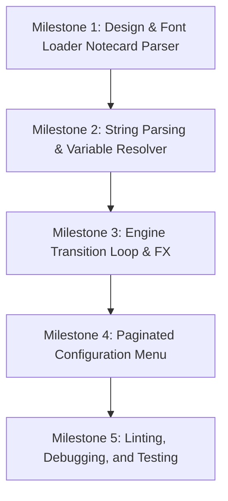

# Nexus Titler — Standalone Dynamic Titler System Design

This document details the architecture, constraints, link messages, LSD schemas, features, and future plans for the Standalone Dynamic Titler system.

---

## 1. System Architecture (Multi-Script Setup)

To maximize LSL memory efficiency, bypass the 64KB Mono limit, and maintain a highly modular design, the titler is split into five cooperating scripts inside the same object (splitting the menu configuration to prevent Stack-Heap Collisions):

```
                  ┌────────────────────────────────────────┐
                  │          notecard: Fonts.txt           │
                  └───────────────────┬────────────────────┘
                                      │
                                      ▼
                  ┌────────────────────────────────────────┐
                  │             titler_loader              │ (Parses fonts & custom settings)
                  └───────────────────┬────────────────────┘
                                      │ (LSD Writes)
                                      ▼
 ┌────────────────────────────────────────────────────────────────────────────────────────┐
 │                                 LINKSET DATA (LSD)                                     │
 └───────────────────┬────────────────────────────────────────────────┬───────────────────┘
                     │ (LSD Reads)                                    │ (LSD Reads)
                     ▼                                                ▼
 ┌────────────────────────────────────────┐      ┌────────────────────────────────────────┐
 │             titler_parser              │      │              titler_menu               │ (Main menu, presets,
 │ (Replaces tags & converts fonts,       │      │ (Handles user touch triggers)          │  message manager)
 │  resolves overrides, writes active     │      └────────────────────┬───────────────────┘
 │  LSD runtime block)                    │                           │
 └───────────────────┬────────────────────┘                           │ (Code 189: HANDOFF)
                     │ (Link Message 185: RENDER_START)               ▼
                     │                           ┌────────────────────────────────────────┐
                     ▼                           │         titler_menu_overrides          │ (Handles sub-menus,
 ┌────────────────────────────────────────┐      │ (Handles sub-menus, role config,       │  fonts, roles,
 │             titler_engine              │      │  granular override editors)            │  status tags)
 │ (Controls llSetText, colors, alpha)    │      └────────────────────────────────────────┘
 └────────────────────────────────────────┘
```

### The Granular Override Engine
Instead of applying configurations globally, each message acts as a self-contained configuration node in LSD. 
When the `titler_engine` requests the next message (Code 186):
1. **Parser Selection:** `titler_parser` selects the next message index.
2. **Override Evaluation:** It checks if specific overrides (color, alpha, transitions, trinkets, height, etc.) are set for this message in LSD.
3. **Fallback Resolution:** If no override is present, it falls back to the global default setting.
4. **Active State Write:** It writes the resolved rendering settings to the `lsd:titler:active:...` runtime keys in LSD.
5. **Tag & Font Resolution:** It parses dynamic tags (including variables, fonts, and roles) on the raw message text (supporting multi-line `\n`).
6. **Engine Trigger:** It triggers `titler_engine` via Code 185, passing the resolved text. The Engine reads the active parameters from the LSD active block and executes the appearance transitions, scrolling, and idle effects.

---

## 2. Features & Capabilities Matrix

The following table tracks all existing, active, planned, and scrapped features of the Nexus Titler system.

| Category | Feature Name | Description | Status | Priority |
| :--- | :--- | :--- | :--- | :--- |
| **Storage** | Settings Persistence | All preferences, configurations, and state variables are stored in LinksetData (LSD) | 🟡 `In Progress` | High |
| **Rendering** | Color & Opacity | Adjust text color (RGB vector) and visibility (alpha) | 🟡 `In Progress` | High |
| **Rendering** | Offset Height | Position floating text vertically above attachment point (-2.0m to +2.0m) | 🟡 `In Progress` | Medium |
| **Rendering** | Trinket Animations | Prepended/appended animated ASCII symbols (Hex, Heart, Kitty, etc.) | 🟡 `In Progress` | Medium |
| **Animation** | Basic Transitions | Transition animations on message change: Instant, Glitch, Wipe, Fade | 🟡 `In Progress` | High |
| **Animation** | Basic Scrolling | Wrap-around ticker for messages longer than the window size | 🟡 `In Progress` | Medium |
| **Parser** | Notecard Font Loader | Reads character translations (`a-z`, `A-Z`, `0-9`) from a notecard to LSD | 🟡 `In Progress` | High |
| **Parser** | Dynamic Variables | Tag replacements for `%name%`, `%username%`, `%owner%`, `%time%`, `%sim%` | 🟡 `In Progress` | High |
| **Parser** | Flexible Status Tag | Progress tag (e.g. `%battery%`, `%sanity%`) with custom styled progress bars | 🟡 `In Progress` | Medium |
| **Parser** | Custom Roles | Allows dynamic templates like `%role:pet%` or `%role:master%` resolved via LSD | 🟡 `In Progress` | High |
| **Menu** | Dynamic Pagination | Scrollable menu panels bypassing the LSL 12-button limit for list configs | 🟡 `In Progress` | High |
| **Architecture** | Granular Overrides | Each message is a config node in LSD, supporting local overrides of all styling parameters | 🟡 `In Progress` | High |
| **Architecture** | Parameter Randomization | Set styling/durations to 'RANDOM', generating randomized values each message cycle | 🟡 `In Progress` | High |
| **Parser** | Multi-Line Support | Render multi-line floating messages separated by `\n` in text boxes | 🟡 `In Progress` | High |
| **Integration** | Chat Open Listener | Listens on a custom chat channel to receive status percentages from external sources | 🟡 `In Progress` | Medium |
| **Animation** | Custom Trans Speeds| User-configurable transition rates (tick intervals) per message or globally | 🟡 `In Progress` | Medium |
| **Animation** | Matrix (Horizontal) | Horizontal scrambling transition where characters glitched-scramble before resolving | 🟡 `In Progress` | Medium |
| **Animation** | Matrix (Vertical) | Vertical cascading code rain descending down newlines before solidifying | 🟡 `In Progress` | Low |
| **Animation** | Typing Transition | Keypress-by-keypress character reveal with terminal cursor | 🔵 `Planned` | Medium |
| **Animation** | Slide Transition | Smooth shifting of text left or right into position | 🔵 `Planned` | Low |
| **FX (Idle)** | Breathing Pulse | Opacity fade pulsation (sinusoidal alpha shifting) | 🔵 `Planned` | Medium |
| **FX (Idle)** | Rainbow Shift | Continuous rotation of text color through hue spectrum | 🔵 `Planned` | Low |
| **Automation** | Environment Triggers | Cycle different lists of messages based on avatar posture (sitting, typing, flying) | 🟣 `Future` | Low |
| **FX (Idle)** | Particle Linkage | Spawn subtle particle streams matching active trinkets around floating text | 🟣 `Future` | Low |
| **Integration** | External API | Link message endpoints to display spank count alerts or combat damage | 🟣 `Future` | Medium |
| **Rendering** | Direct Prim Coloring | Change color of parent prim face instead of text (use standard floating text instead) | 🔴 `Scrapped` | N/A |

---

## 3. LinksetData (LSD) Schema

All persistent configurations are stored with a unique prefix `lsd:titler:` to prevent namespace collisions.

### 3.1 Global Configuration Keys
*   `lsd:titler:enabled` (integer): `0` for off, `1` for active.
*   `lsd:titler:color` (vector): Default text color, e.g. `<1.0, 0.6, 0.8>`.
*   `lsd:titler:alpha` (float): Default text opacity, e.g. `1.0`.
*   `lsd:titler:height` (float): Default prim vertical offset, e.g. `0.5`.
*   `lsd:titler:owner_name` (string): User-defined owner name (resolved via `%owner%`).
*   `lsd:titler:anim_style` (string): Default transition style (`GLITCH`, `WIPE`, `FADE`, `TYPING`, `MATRIX_VERT`, `MATRIX_HORIZ`, `SLIDE`, `INSTANT`).
*   `lsd:titler:trans_speed` (float): Default transition tick speed in seconds (e.g. `0.15`).
*   `lsd:titler:scroll_enabled` (integer): `0` or `1`.
*   `lsd:titler:scroll_width` (integer): Character width limits for scrolling.
*   `lsd:titler:flicker_glitch` (integer): `0` or `1` (random noise on idle).
*   `lsd:titler:pulse_enabled` (integer): `0` or `1` (breathing alpha).
*   `lsd:titler:rainbow_enabled` (integer): `0` or `1` (color shifting).
*   `lsd:titler:cycle_order` (string): `SEQ` or `SHUFFLE`.
*   `lsd:titler:status_tag` (string): Custom tag name for status bar, e.g. `battery` (resolves `%battery%` or `%custom_tag%`).
*   `lsd:titler:status_val` (float): Status value percentage between `0.0` and `100.0`.
*   `lsd:titler:status_channel` (integer): Active open listener chat channel (e.g. `99`).
*   `lsd:titler:status_bar_style` (string): Bar visual styling prefix, e.g. `BLOCK` (`████░`), `HEART` (`♥♥♥♥♡`), `SPARK` (`✦✦✦✦✧`).

### 3.2 Messages & Local Overrides Storage
*   `lsd:titler:msg_count` (integer): Total number of messages saved in rotation.
*   `lsd:titler:msg:<idx>:text` (string): Raw message text containing formatting/tags (supports newlines).
*   `lsd:titler:msg:<idx>:dur` (float): Rotation display duration in seconds.
*   `lsd:titler:msg:<idx>:color` (string): Local override start color vector (blank uses default).
*   `lsd:titler:msg:<idx>:color_end` (string): Local override end color vector for gradient interpolation (blank for static).
*   `lsd:titler:msg:<idx>:color_trans` (string): Local override transition color vector (blank for default transition color).
*   `lsd:titler:msg:<idx>:alpha` (string): Local override alpha float (blank uses default).
*   `lsd:titler:msg:<idx>:height` (string): Local override height offset (blank uses default).
*   `lsd:titler:msg:<idx>:align` (string): Local override smart alignment, e.g. `LEFT`, `RIGHT`, `CENTER` (blank uses default).
*   `lsd:titler:msg:<idx>:trans_in` (string): Local override transition in style (blank uses default).
*   `lsd:titler:msg:<idx>:trans_out` (string): Local override transition out style (blank uses default).
*   `lsd:titler:msg:<idx>:trans_speed` (string): Local override tick speed (blank uses default).
*   `lsd:titler:msg:<idx>:trinket_style` (string): Local override trinket style (blank uses default).
*   `lsd:titler:msg:<idx>:trinket_pos` (string): Local override trinket position (blank uses default).
*   `lsd:titler:msg:<idx>:scroll_width` (string): Local override scroll width (blank uses default).
*   `lsd:titler:msg:<idx>:scroll_enabled` (string): Local override scroll enabled (blank uses default).

### 3.3 Active Runtime Block (Written by Parser, Read by Engine)
*   `lsd:titler:active:color` (vector): Currently resolved rendering start color.
*   `lsd:titler:active:color_end` (vector): Currently resolved rendering end color (same as start color if static).
*   `lsd:titler:active:color_trans` (vector): Currently resolved transition flash color.
*   `lsd:titler:active:alpha` (float): Currently resolved rendering alpha.
*   `lsd:titler:active:height` (float): Currently resolved vertical height.
*   `lsd:titler:active:align` (string): Currently resolved alignment (`LEFT`, `RIGHT`, `CENTER`).
*   `lsd:titler:active:trans_in` (string): Active transition in style.
*   `lsd:titler:active:trans_out` (string): Active transition out style.
*   `lsd:titler:active:trans_speed` (float): Active transition tick interval.
*   `lsd:titler:active:trinket_style` (string): Active trinket selection.
*   `lsd:titler:active:trinket_pos` (string): Active trinket placement.
*   `lsd:titler:active:scroll_width` (integer): Active scroll window width.
*   `lsd:titler:active:scroll_enabled` (integer): Active scroll state toggle.

### 3.4 Fonts Storage
*   `lsd:titler:active_font` (string): Name of active font mapping (or `"DEFAULT"`).
*   `lsd:titler:font_list` (string): Pipe-separated names of loaded fonts.
*   `lsd:titler:font:<fontname>:source` (string): Pipe-separated source character maps (e.g. `abcdefghijklmnopqrstuvwxyz`).
*   `lsd:titler:font:<fontname>:target` (string): Pipe-separated translated glyph maps matching respective sources.

### 3.5 Custom Roles Storage
*   `lsd:titler:role_list` (string): Pipe-separated list of defined role names (e.g. `pet|master|owner`).
*   `lsd:titler:role:<roleName>` (string): The resolved name text for this role.

---

## 4. Communication Protocol (Link Messages)

The standalone titler scripts communicate using the following link message API:

| Code | Direction | Purpose | String Payload | Key Payload |
|---|---|---|---|---|
| **180** | UI/Loader ➔ All | Reload configurations from LSD | `RELOAD` | `NULL_KEY` |
| **181** | UI ➔ Engine | Quick Enable/Disable toggle | `1` (Enable) or `0` (Disable) | `NULL_KEY` |
| **182** | UI/Parser ➔ Engine | Preview message override | The formatted text to show temporarily | User Key (for session tracking) |
| **183** | UI ➔ Engine | Quiet mode toggle | `1` (Quiet/Hide text) or `0` (Resume) | `NULL_KEY` |
| **184** | External API ➔ Parser | Update Status Tag Value | Float percentage string, e.g. `"80.0"` | `NULL_KEY` |
| **185** | Parser ➔ Engine | Trigger message display | `RENDER_START\|` + Formatted message text | `NULL_KEY` |
| **186** | Engine ➔ Parser | Request next message from rotation | `NEXT_MSG` | `NULL_KEY` |
| **187** | Loader ➔ UI | Font loading status | `STATUS\|fontname\|OK` or `ERROR\|msg` | `NULL_KEY` |
| **188** | Menu/Ext ➔ Parser | Update custom role value | `roleName\|value` | `NULL_KEY` |
| **189** | Menu Handoff | Hand over dialog user control | `HANDOFF\|context\|msgIdx\|pageOffset` | User Key |

---

## 5. Development Milestones & Checklist



### [ ] Milestone 1: Font Loader Script (`titler_loader.lsl`)
*   [ ] Read lines from a notecard named `Fonts.txt`.
*   [ ] Parse syntax: `FontName | SourceCharacters | TargetCharacters`.
*   [ ] Store mappings in LSD under `lsd:titler:font:<fontname>:source` and `target`.
*   [ ] Manage font list index keys.

### [ ] Milestone 2: Parser Script (`titler_parser.lsl`)
*   [ ] Listen for transition requests and cycle events.
*   [ ] Select message overrides and fill global defaults to `lsd:titler:active:...`.
*   [ ] Resolve standard tags: `%name%`, `%username%`, `%owner%`, `%time%`, `%sim%`.
*   [ ] Resolve flexible progress tag `%<status_tag>%` using customized progress bars.
*   [ ] Resolve dynamic custom roles: `%role:<key>%` by looking up LSD values.
*   [ ] Convert alphabetical or native characters using font translation mappings.
*   [ ] Implement chat open listener (`llListen`) on channel `lsd:titler:status_channel`.
*   [ ] Implement smart alignment left/right trailing space padding.
*   [ ] Forward processed message payload to the engine via code 185.

### [ ] Milestone 3: Engine Script (`titler_engine.lsl`)
*   [ ] Read rendering settings from `lsd:titler:active:...` runtime block at the start of a message.
*   [ ] Implement transition ticker loop (Glitch, Wipe, Typing, Slide, Matrix-Horiz, Matrix-Vert) using custom speeds.
*   [ ] Implement scrolling offset calculation for wide or multi-line strings.
*   [ ] Add Trinket animation sub-timers.
*   [ ] Add Pulse breathing alpha effects (sinusoidal scaling on timer).
*   [ ] Add Rainbow color vector rotation (shifting hue).

### [ ] Milestone 4: Paginated Menu Script (`titler_menu.lsl`)
*   [ ] Create main menu with sub-pages: Messages, Animation, Appearance, Trinkets, Fonts, Roles.
*   [ ] Implement dynamic list pagination logic to support infinite messages, roles, and fonts.
*   [ ] Add message manager sub-menus to customize raw text, duration, and granular overrides (color, alpha, height, transitions, speed, trinkets).
*   [ ] Add textbox prompt workflows for entering custom owner name, status tag properties (name, channel, styles), roles, and configuration parameters.

### [ ] Milestone 5: Integration, Linting, & Testing
*   [ ] Run `lslint` on all four scripts.
*   [ ] Deploy compile updates using PowerShell `-Encoding UTF8`.
*   [ ] Perform adversarial test (large inputs, invalid color vectors, missing notecards, missing keys).

---

## 6. Technical Constraints & Multi-Language Font Mechanics

### 6.1 Multi-Line, Byte, and Character Limits (Smart Alignment)
Floating text in Second Life (`llSetText`) faces strict engine limits that we must handle programmatically:
*   **Byte limit:** The maximum size of the text string passed to `llSetText` is exactly **254 bytes**.
    *   *ASCII Characters:* Take 1 byte each (e.g., standard text allows ~250 characters).
    *   *Unicode Glyph Characters (Bubble, Gothic, Small Caps):* Take 3 to 4 bytes per character. If a message is converted to bubble text, the character limit drops to **~60 characters** before the SL engine rejects the excess or throws a silent truncation.
*   **Line count limit:** There is no hard byte code limit for newlines (`\n`), but visual space constraints become unmanageable if height is tall. We enforce a software limit of **max 6 lines**.
*   **Smart Alignment Calculations:** 
    *   Left/Right alignment works by calculating the character length of each line, determining the longest line, and padding the other lines with trailing/leading spaces.
    *   To prevent padding spaces from eating up the 254-byte budget, the parser calculates the cumulative byte size of the padded string. If it exceeds 254 bytes, it automatically strips the padding and falls back to standard centered text to protect message visibility.

### 6.2 Language-Agnostic Font Mapping (Japanese & Other Languages)
Instead of assuming a static English `a-z` alphabet mapping, the loader uses a dynamic **Source-to-Target Character Map** parsed from the `Fonts.txt` notecard.

*   **Notecard Syntax:**
    `FontName | SourceCharacterString | TargetCharacterString`
*   **English Example:**
    `Bubble | abcdefghijklmnopqrstuvwxyz | ⓐⓑⓒⓓⓔⓕⓖⓗⓘⓙⓚⓛⓜⓝⓞⓟⓠⓡⓢⓣⓤⓥⓦⓧⓨⓩ`
*   **Japanese/Katakana Example:**
    `Halfwidth Katakana | ァアィイゥウェエォオカガキギクケコ | ｱｲｳｴｵｶｷｸｹｺｻｼｽｾｿﾀﾁﾂﾃﾄ`
*   **Cyrillic Example:**
    `Gothic Cyrillic | абвгдежзийклмнопрстуфхцчшщъыьэюя | 𝔄𝔅𝔖𝔇𝔈...`

#### Parsing & Translation Execution:
1. During start-up, `titler_loader` reads each font's `Source` and `Target` character strings from `Fonts.txt` and stores them in LSD:
   * `lsd:titler:font:<fontname>:source`
   * `lsd:titler:font:<fontname>:target`
2. At runtime, the `titler_parser` translates each letter by running:
   ```lsl
   integer idx = llSubStringIndex(source_chars, char);
   if (idx != -1) {
       char = llGetSubString(target_chars, idx, idx);
   }
   ```
3. **Foreign Text Immunity:** If a character is not found in the `SourceCharacterString` (e.g. Japanese Kanji in an English Bubble font), the index is `-1`, and the character remains completely untouched. This naturally supports mixing stylized English fonts with native Japanese or other languages in the same line without breaking rendering!

### 6.3 Parameter Randomization Engine
To support high dynamic variety and organic layouts, any configuration override can be set to the value `"RANDOM"`. The `titler_parser` resolves `"RANDOM"` parameters dynamically each time a message is selected before writing them to the active block:
*   **Colors (`color`, `color_end`, `color_trans`):** Generates a random color vector: `<llFrand(1.0), llFrand(1.0), llFrand(1.0)>`.
*   **Alphas (`alpha`):** Generates a random opacity float between `0.2` and `1.0`: `0.2 + llFrand(0.8)`.
*   **Heights (`height`):** Selects a random vertical offset: `-1.5 + llFrand(3.0)` meters.
*   **Alignments (`align`):** Selects randomly from `["LEFT", "RIGHT", "CENTER"]`.
*   **Transitions (`trans_in`, `trans_out`):** Picks a random animation style: `["GLITCH", "WIPE", "FADE", "TYPING", "MATRIX_VERT", "MATRIX_HORIZ", "SLIDE"]`.
*   **Transition Speed (`trans_speed`):** Selects a random tick rate: `0.05 + llFrand(0.20)` seconds.
*   **Trinkets (`trinket_style`):** Picks a random symbol set from the loaded list: `["HEX", "HEART", "SPARK", "KITTY", "SLEEPY", "DOTPULSE", "BEAR", "DANCE", "SHY", "ZAP", "MUSIC"]`.
*   **Duration (`dur`):** Picks a random display length between 3 and 10 seconds: `3.0 + llFrand(7.0)`.

---

## 7. Menu Layout & Navigation Flow

To bypass LSL's 12-button limit per dialog window, the configuration interface uses paginated menu blocks and modular sub-menus.

### 7.1 Menu Tree Architecture
```
                                ┌───────────────────┐
                                │   Main Menu       ├─────────────────────────┐
                                └─────────┬─────────┘                         │
                                          │                                   │
              ┌───────────────────────────┼─────────────────────┐             │
              ▼                           ▼                     ▼             ▼
     ┌─────────────────┐         ┌─────────────────┐   ┌───────────────┐ ┌───────────────┐
     │ Messages List   │         │ Global Appearance│   │ Global Anim   │ │ Global Trink  │
     │ (Paginated)     │         │ (Color,Alpha,H) │   │ (Speed,Scroll)│ │ (Style,Pos)  │
     └────────┬────────┘         └─────────────────┘   └───────────────┘ └───────────────┘
              │
              ▼ (Click Msg)
     ┌─────────────────┐
     ┌─────────────────┐
     │ Message Editor  │
     └────────┬────────┘
              ├───────────────────────────┬───────────────────────────┐
              ▼                           ▼                           ▼
     ┌─────────────────┐         ┌─────────────────┐         ┌─────────────────┐
     │ Before FX       │         │ During FX       │         │ After FX        │
     │ (Trans In Style,│         │ (Trinkets,      │         │ (Trans Out Style│
     │  Speed, Color)  │         │  Scrolling)     │         │  Speed, Color)  │
     └─────────────────┘         └────────┬────────┘         └─────────────────┘
                                          │
                                          ▼
                                 ┌─────────────────┐
                                 │ Appearance FX   │
                                 │ (Color, Alpha,  │
                                 │  Height, Align) │
                                 └─────────────────┘
```

### 7.2 Dialog Specifications

#### 1. Main Menu Page
*   **Header:** Titler configuration status, global toggles, active font name, current role count.
*   **Buttons:**
    *   `[Enable]/[Disable]`: Toggles titler active state.
    *   `Messages`: Opens paginated Message Manager.
    *   `Appearance`: Global color, opacity, height defaults.
    *   `Animation`: Global transition style, transition speed, scroll width defaults.
    *   `Trinkets`: Global idle trinket shapes and positions.
    *   `Fonts`: Opens font selections and reload options.
    *   `Roles`: Opens Roles config manager.
    *   `Status Tag`: Configuration menu for the flexible status tag (name, channel, bar style).
    *   `[Close]`: Closes menu.

#### 2. Messages List (Paginated Manager)
*   **Header:** List of defined rotation messages showing raw text and duration (e.g. `1: "Hello %time%" (5s)`).
*   **Buttons:**
    *   `[◀ Prev]`, `[Next ▶]`: Scroll page index.
    *   `[Add Msg]`: Prompts raw text, then duration to add a new message block.
    *   `[Clear All]`: Wipes message list.
    *   `[Back]`: Returns to Main Menu.
    *   `Msg 1` through `Msg N`: Direct edit links. Clicking opens the Message Editor for that specific index.

#### 3. Message Editor (`Msg #X`)
*   **Header:** Summary of local overrides and properties for message index `X`.
*   **Buttons:**
    *   `Change Text`: Textbox prompt to replace text string (supports `\n`).
    *   `Duration`: Textbox prompt to change display duration in seconds (or `"RANDOM"`).
    *   `Before FX...`: Opens Before FX Sub-Menu.
    *   `During FX...`: Opens During FX Sub-Menu.
    *   `After FX...`: Opens After FX Sub-Menu.
    *   `Appearance...`: Opens Appearance Overrides Sub-Menu.
    *   `Presets...`: Opens Style Presets Sub-Menu.
    *   `Preview`: Instantly flashes this message to the viewer for testing.
    *   `Delete`: Deletes this message block, shifting index numbers down.
    *   `[Back]`: Returns to Messages List.

#### 4. Before FX Sub-Menu
*   **Header:** Options to configure Transition-In (appearing) animations.
*   **Buttons:**
    *   `In Style`: Select entry transition (Glitch, Wipe, Typing, Matrix-V, Matrix-H, Slide, Instant, default).
    *   `In Speed`: Textbox prompt for Transition-In tick speed (seconds).
    *   `In Color`: Textbox prompt for entry flash color (RGB vector, `"RANDOM"`, `"default"`).
    *   `[Back]`: Returns to Message Editor.

#### 5. During FX Sub-Menu
*   **Header:** Options to configure idle effects active while the message displays.
*   **Buttons:**
    *   `Trink Style`: Selects trinket symbol set.
    *   `Trink Pos`: Toggles PREFIX, SUFFIX, BOTH, default.
    *   `Trink Speed`: Toggles SLOW, MED, FAST, default.
    *   `Scroll Width`: Textbox prompt for scroll window width (characters).
    *   `Scroll Toggle`: Toggles scrolling state (ON, OFF, default).
    *   `Flicker Glitch`: Toggles random text corruption (ON, OFF, default).
    *   `Pulse (Later)`: Postponed breathing alpha configuration.
    *   `Rainbow (Later)`: Postponed rainbow color shifting.
    *   `[Back]`: Returns to Message Editor.

#### 6. After FX Sub-Menu
*   **Header:** Options to configure Transition-Out (disappearing) animations.
*   **Buttons:**
    *   `Out Style`: Select exit transition (Glitch, Wipe, Typing, Matrix-V, Matrix-H, Slide, Instant, default).
    *   `Out Speed`: Textbox prompt for Transition-Out tick speed (seconds).
    *   `Out Color`: Textbox prompt for exit flash color (RGB vector, `"RANDOM"`, `"default"`).
    *   `[Back]`: Returns to Message Editor.

#### 7. Appearance Overrides Sub-Menu
*   **Header:** Local overrides for the message structure and styling.
*   **Buttons:**
    *   `Start Color`: Sets starting color vector (prompts RGB, `"RANDOM"`, `"default"`).
    *   `End Color(Later)`: Postponed gradient morph destination color.
    *   `Alpha Override`: Sets local alpha transparency (prompts float, `"RANDOM"`, `"default"`).
    *   `Height Override`: Sets local vertical height offset (prompts float, `"RANDOM"`, `"default"`).
    *   `Smart Align`: Toggles alignment (`LEFT`, `RIGHT`, `CENTER`, `default`).
    *   `Randomize All`: Sets all override parameters on this message to `"RANDOM"`.
    *   `[Back]`: Returns to Message Editor.

#### 8. Style Presets Sub-Menu
*   **Header:** Options to apply pre-configured templates.
*   **Buttons:**
    *   `Preset: Cyber` (Neon green color, vertical matrix transition, hex trinkets).
    *   `Preset: Princess` (Pink color, fade transition, heart trinkets).
    *   `Preset: Terminal` (White color, typing transition, no trinkets).
    *   `Preset: Glitch` (Random colors, glitch in/out transition, flicker active).
    *   `Preset: Reset` (Clears all overrides on this message, reverting to defaults).
    *   `[Back]`: Returns to Message Editor.


## Section 4: FIFO Message Queue & External Script API

To support dynamic status updates, game integrations, and notification triggers from external scripts, a **First-In, First-Out (FIFO) Message Queue** has been integrated into the `titler_parser` module.

### 1. Link Message API (Code 190)
Other scripts in the same linkset can enqueue temporary custom messages by sending a link message with **Code 190**. The string payload is pipe-separated (`|`) and supports the following structure:

`Type | Text | Duration | Color | Alpha | TransIn | TransOut | TransSpeed | TrinketStyle | TrinketPos | Align | Height | ScrollEnabled`

*   **Type**:
    *   `QUEUE`: Appends the message to the tail of the FIFO queue. It will display in order after the current message cycle.
    *   `IMMEDIATE`: Interrupts the current running message, inserts this message at the head of the queue (index `0`), and immediately triggers a Transition-In to display it.
*   **Parameters (`Duration` through `ScrollEnabled`)**:
    *   Specify any custom override parameter for this queued item.
    *   Pass `"default"` or leave empty `""` to use the global styling defaults.

*Example code for external scripts:*
```lsl
// Enqueue a simple yellow system alert with 3-second display duration
llMessageLinked(LINK_SET, 190, "QUEUE|SYSTEM ERROR: Connection lost.|3.0|<1.0,1.0,0.0>|1.0|TYPING|GLITCH|default|HEX|BOTH|default|default|default", NULL_KEY);

// Display an immediate red critical warning instantly
llMessageLinked(LINK_SET, 190, "IMMEDIATE|⚠ CRITICAL ALARM ⚠|5.0|<1.0,0.0,0.0>|1.0|GLITCH|GLITCH|0.08|default|default|default|default|default", NULL_KEY);
```

### 2. Queued Status Progress Bar Notifications & Multi-Tag API
The percentage status bar updates can be configured to automatically enqueue formatted HUD alerts when received via Link Message **Code 184** or Chat Listeners.
*   **Toggle Control**: Configured inside the **Status Progress Bar Menu** via the `Queue` button.
*   **Multi-Tag Payload Format**: External scripts can update specific status values dynamically by sending a pipe-separated payload:
    `TagName | PercentageValue | Duration | Color | Alpha | TransIn | TransOut | TransSpeed | TrinketStyle | TrinketPos | Align | Height | ScrollEnabled`
    *   *Simple Tag Update (backward compatible)*: `battery | 80` (Updates `%battery%` value to `80`).
    *   *Styled Tag Update Override*: `health | 35 | 3.0 | <1,0,0> | 1.0 | TYPING | GLITCH` (Updates `%health%` and queues a custom styled red notice).
    *   *Raw value*: If no tag name or pipe is sent (e.g. `"80"`), the update automatically updates the default menu-configured `status_tag`.
*   **Behavior**: When enabled (`lsd:titler:queue_status_updates` = 1), any status update automatically constructs a styled notification frame (e.g. `⬡ battery: [█████] (100%) ⬡`) enqueued with the specified overrides.
*   **Resolve Scanning**: The parser dynamically resolves *any* registered status tag present in the raw text (e.g., resolving `%health%`, `%mana%`, and `%battery%` simultaneously within a single message frame).

### 3. Queue Execution Flow
1.  When a message finishes showing, the engine requests `NEXT_MSG` (Code 186).
2.  `titler_parser` checks if `lsd:titler:queue_count` > 0.
3.  If items are queued, it pops index `0`, shifts remaining queue indices up, applies the queue item's custom parameter overrides, resolves text tags, and triggers the engine's `RENDER_START`.
4.  If the queue is empty, the parser seamlessly resumes the normal rotating message cycle.


## Section 5: Typing & Blinking Cursors

To achieve high-fidelity command terminal aesthetics, the titler supports custom cursors for the `TYPING` transition style and a terminal-style blinking cursor during the idle phase.

### 1. Custom Typing Cursors
Users can select the default cursor character used during transition animations.
*   **Location**: Configured inside the **Global Animation Defaults Menu** via the `Set Cursor` button.
*   **Options**:
    *   `_` (Underscore - classic terminal)
    *   `|` (Vertical pipe - standard word processor)
    *   `█` (Solid rectangular block - vintage console)
    *   `▊` (Partial vertical block - modern terminal)
    *   `None` (Disables the cursor character entirely during rendering)

### 2. Blinking Idle Cursors
Once a transition finishes, a blinking cursor can flash at the very end of the static message to simulate an active shell prompt.
*   **Toggle Control**:
    *   *Global Default*: Toggled inside the **Global Animation Defaults Menu** via the `Blink` toggle button.
    *   *Per-Message Override*: Configured inside the **During FX Menu** via the `Blink Toggle` button (cycles: Inherited ➔ ON ➔ OFF).
*   **Blink Timing & Performance**:
    *   *Static Messages*: To conserve simulator event performance, the engine's timer event slows down to a low-overhead `0.5s` interval, alternating the cursor visibility on every tick.
    *   *Animated Messages (Trinkets/Flicker active)*: Alternates cursor visibility once every 4 ticks of the fast `0.15s` animation loop to maintain a stable ~0.6s blink speed without adding separate timers.
    *   *Scrolling Messages*: The blinking cursor is automatically hidden while text is actively scrolling to prevent visual jumpiness.


## Section 6: Per-Message Font Overrides

The active display font can now be overridden on a per-message basis, allowing different messages in your rotation loop to display in completely different typography styles (e.g. standard Gothic vs Small Caps vs Normal).

### 1. Database Schema
*   **Local Override**: Saved in LinksetData under the message prefix:
    *   Key: `lsd:titler:msg:<idx>:font`
    *   Value: Custom font name (e.g. `Gothic`, `SmallCaps`), or `""`/`default` (inherits global default).
*   **Active Target**: When a message becomes active, the parser resolves the override and writes the target font name to `lsd:titler:active:font` for the translator to consume.

### 2. Message Editor Menu Integration
*   **Button**: A new `Set Font` button has been added to the message manager editor dialog (`render_msg_editor()`).
*   **Behavior**:
    *   Clicking `Set Font` hands off to the overrides fonts configuration menu (`render_fonts_menu()`) with the message index context active.
    *   In message context, the font selection menu displays a `default` button instead of `DEFAULT`. Selecting `default` clears the local override, returning it to `Inherited`.
    *   Selecting any font from the loaded list writes it directly to the message's local overrides block.
*   **Data Integrity**:
    *   Deleting overrides via presets or clearing a message automatically purges `lsd:titler:msg:<idx>:font`.
    *   Shifting messages up in the queue on deletion correctly moves the font configuration alongside all other style overrides.


## Section 7: Cascading Style Inheritance

To support fluid visual transitions, the titler implements cascading style inheritance for rotating messages. 

### 1. Cascading Inheritance Behavior
When a rotating message has a setting configured as `Inherited` (empty string in local override `lsd:titler:msg:<idx>:<setting>`):
*   Instead of resetting directly to the global default setting, the message inherits the **currently active style** from the previous rotating message.
*   This style cascades down the rotation loop continuously. A single style change (e.g. changing color to Red) will flow and carry over into all subsequent messages that are set to `Inherited`, until another message explicitly overrides it (e.g. changing color back to blue or default).
*   If the script resets or there are no previous active styles, the inheritance falls back to the ultimate global default.

### 2. Supported Parameters
Cascading active inheritance applies to all key styling and animation parameters:
*   **Colors**: `color`, `color_end`, `color_trans`
*   **Opacity**: `alpha`
*   **Dimensions**: `height`, `scroll_width`
*   **Alignment**: `align`
*   **Transitions**: `trans_in`, `trans_out`, `trans_speed`
*   **Trinkets**: `trinket_style`, `trinket_pos`
*   **Toggles**: `scroll_enabled`, `flicker_glitch`, `blink_cursor`
*   **Typography**: `font`

### 3. Namespace Isolation (`lsd:titler:rotate:active:*`)
To prevent one-off enqueued system alerts (e.g. warning cards or status notices) from corrupting the style flow of the main message rotation:
*   Resolved rotating message styles are saved in a separate namespace: `lsd:titler:rotate:active:<setting>`.
*   Rotating messages read from and update the `rotate:active` namespace.
*   Temporary queue notifications and immediate alerts do **not** modify this block, ensuring the main rotating loop resumes its correct styling once the alert concludes.


